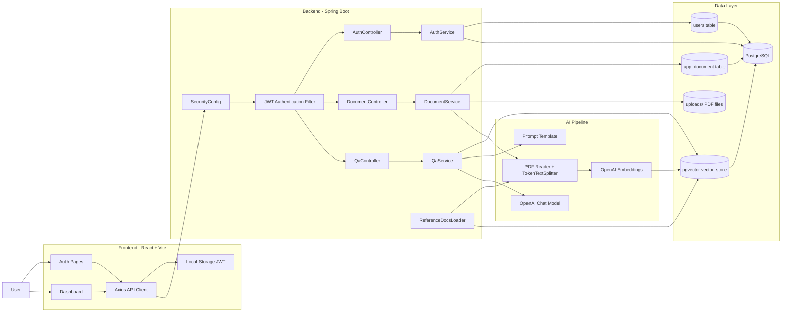

# SmartDocs AI

SmartDocs AI is a full-stack RAG application for private PDF question answering. Users can register, upload documents, index them into a pgvector-backed vector store, and ask grounded questions through a React dashboard powered by Spring Boot, Spring AI, PostgreSQL, and OpenAI models.

## Architecture



## Request Flow

### Authentication

1. The React frontend sends register or login requests to `/api/auth`.
2. `AuthService` validates credentials, hashes passwords with BCrypt, and stores users in PostgreSQL.
3. The backend returns a JWT token.
4. The frontend stores the token in local storage and attaches it to future API requests.

### Document Upload and Indexing

1. An authenticated user uploads a PDF from the dashboard.
2. `DocumentService` validates the file, saves it under `uploads/`, and stores document metadata in PostgreSQL.
3. Spring AI reads the PDF and splits it into chunks.
4. Each chunk is tagged with `userId`, `documentId`, and filename metadata.
5. Embeddings are generated and written into the pgvector-backed `vector_store`.

### Question Answering

1. The dashboard sends a question to `/api/qa/ask`, optionally scoped to one document.
2. `QaService` runs similarity search in the vector store using the authenticated user's metadata filter.
3. Matching chunks are inserted into the prompt template in `src/main/resources/prompts/smartdocs-prompt.st`.
4. The OpenAI chat model generates a grounded answer and returns it to the frontend.

## Tech Stack

- Backend: Spring Boot, Spring Security, Spring Data JPA, Spring AI
- Frontend: React, Vite, React Router, Axios
- Database: PostgreSQL
- Vector Search: PGVector
- AI Models: OpenAI chat model and embedding model
- Auth: JWT + BCrypt
- File Processing: Spring AI PDF reader + token text splitting

## Project Structure

```text
frontend/
  src/pages/            React routes for home, auth, and dashboard
  src/services/api.js   API client and JWT storage helpers
src/main/java/com/ayush/docsai/
  config/               Spring Security configuration
  controller/           REST endpoints
  service/              Auth, document ingestion, and Q&A logic
  repository/           JPA repositories
  entity/               User and document entities
  security/             JWT token creation and request filtering
src/main/resources/
  application.yaml      App, database, and AI configuration
  prompts/              Prompt template used for grounded answers
  docs/                 Optional seeded reference PDF
  schema.sql            Vector store schema support
uploads/                Stored user PDFs at runtime
```

## Getting Started

### Prerequisites

- Java 17+
- Maven
- Node.js 18+
- Docker
- OpenAI API key

### 1. Start PostgreSQL with pgvector

```bash
docker compose up -d
```

The default local database is exposed on port `5440`.

### 2. Configure environment variables

Create a `.env` file for the backend with values such as:

```env
OPENAI_API_KEY=your-openai-api-key
DB_HOST=localhost
DB_PORT=5440
DB_NAME=aidocs
DB_USER=postgres
DB_PASSWORD=postgres
JWT_SECRET=change-this-secret
FRONTEND_URL=http://localhost:5173
```

### 3. Run the backend

```bash
./mvnw spring-boot:run
```

On Windows PowerShell:

```powershell
.\mvnw.cmd spring-boot:run
```

### 4. Run the frontend

```bash
cd frontend
npm install
npm run dev
```

If needed, point the frontend at the backend with:

```env
VITE_API_URL=http://localhost:8080/api
```

## API Surface

- `POST /api/auth/register`
- `POST /api/auth/login`
- `GET /api/documents`
- `POST /api/documents/upload`
- `DELETE /api/documents/{documentId}`
- `POST /api/qa/ask`

## Notes

- Uploaded PDFs are user-scoped during retrieval through vector metadata filters.
- `ReferenceDocsLoader` can optionally seed a bundled reference PDF when `SEED_REFERENCE_DOCS=true`.
- The backend accepts PDF uploads up to 10 MB.

## License

This project is for educational and portfolio use.
